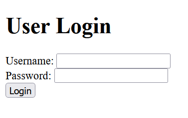
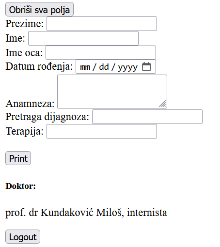

# WEBiz aplikacija

## WEBiz = WEB izveštaj 
je web aplikacija osmišljena kao template za pisanje lekarskih izveštaja i njihovo pohranjivanje.  
WEBiz je namenjen primarno za korišćenje na LAN mrežama.

Aplikacija podiže flask server koji renderuje web stranu. 
Korisnik se loguje

i nakon uspešnog logina otvara se glavna strana

- Polje **Pretraga dijagnoza** omogućava filtriranje i selekciju svih registrovanih dijagnoza.
- Polje **Doktor** popunjava se podacima vezanim za logovanog korisnika.

Nakon pritiska na "print", uneti podaci se pohranjuju u databazu, i otvara se print dijalog za štampanje izveštaja.